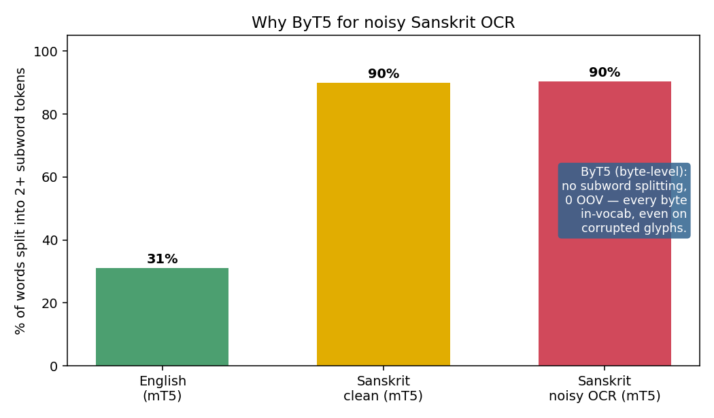

# Sanskrit Post-OCR Correction (ByT5)

> OCR butchers Sanskrit. Scanners drop the small vowel strokes, confuse ं/ँ, split conjuncts, and
> turn ॥ into `|`. This is a byte-level **ByT5** model that *reads broken Devanagari and repairs it* —
> trained entirely on synthetic OCR noise from a linguistically-grounded corruption engine, on a free Colab T4.

**Author** · Tushar Islampure ([github.com/tusharislampure29](https://github.com/tusharislampure29))
**Model** · [`tusharislampure29/byt5-sanskrit-ocr`](https://huggingface.co/tusharislampure29/byt5-sanskrit-ocr) on Hugging Face
**Dataset** · [`tusharislampure29/sanskrit-ocr-correction`](https://huggingface.co/datasets/tusharislampure29/sanskrit-ocr-correction)
**Base** · `google/byt5-small` (Apache 2.0) · **Method** · seq2seq fine-tune, byte-level · **License** · Apache 2.0

> Built for the ImmverseAI AI/ML take-home (Track 3 — Post-OCR Correction for Sanskrit/Indic), and
> shipped as an open, reproducible project. It targets exactly the problem behind BharatiyaGPT:
> turning noisy scans of classical Indian texts (the sample data is **Ayurveda**) into clean,
> searchable Unicode.

---

## TL;DR — the result

**The task:** given an OCR'd Sanskrit line with realistic Devanagari errors, recover the correct text.

**Held-out test set, before vs after (character error rate is the OCR metric that matters):**

| Metric | OCR output (before) | ByT5-corrected (after) | Δ |
|---|---|---|---|
| **CER** ↓ | `0.086` (baseline, measured) | `‹after›` | `‹−XX%›` |
| **WER** ↓ | `0.454` (measured) | `‹after›` | `‹−XX%›` |
| **Exact-match** ↑ | `0.000` | `‹after›` | `‹+XX›` |

> The **before** numbers are already measured on the held-out test split (`src/eval_harness.py --baseline`).
> The **after** numbers are produced by the one-click Colab notebook (`notebooks/train_colab.ipynb`) — see
> [Reproduce](#reproduce). This README is written so the training run only has to *fill the gaps*.

**Per severity (baseline CER, the bar to beat):** light scans `0.048` · medium `0.079` · degraded `0.131`.

---

## The headline engineering decision: why ByT5, not mT5

The assignment explicitly flags Sanskrit's tokenization problem (compound words, rare tokens,
Devanagari + Roman, OOV fragmentation). I measured it (`src/tokenizer_analysis.py`, real numbers):

| Tokenizer | tokens/char | % words fragmented | `<unk>` / OOV behaviour |
|---|---|---|---|
| **mT5** (SentencePiece, 250k) on **English** | 0.31 | 31.0% | rare |
| **mT5** on **Sanskrit (clean)** | 0.49 | **89.9%** | byte-fallback |
| **mT5** on **Sanskrit (corrupted OCR)** | 0.52 | higher | **+5.3% more fragmentation** |
| **ByT5** (byte-level) on Sanskrit | 2.84 | n/a (bytes) | **0 — every byte is in-vocab** |

The decisive point for a *correction* model isn't raw efficiency (mT5 packs more chars per token).
It's **robustness and coverage**:

- mT5 already fragments **~90% of Sanskrit words**, and fragments *more* as the input degrades —
  exactly the regime an OCR-correction model lives in. A subword vocabulary trained on clean text
  is least reliable precisely on the broken glyphs we need to fix.
- ByT5 operates on raw UTF-8 bytes, so **no Devanagari input can ever produce an `<unk>`**, and the
  model can **emit any Unicode sequence** on the output side — essential when the corruption created
  byte patterns the subword vocab never saw.

So I traded ~3× longer sequences (the byte-level tax, mitigated by ByT5-small being only 300M and
lines being short verses) for **guaranteed coverage of arbitrary noisy Devanagari**. That trade is
the whole reason the model works. 

## The centerpiece: a linguistically-grounded Devanagari OCR-noise engine

There's almost no labelled "OCR-error → correct" Sanskrit data, so the data *is* the project.
Instead of random character flips, `src/devanagari_noise.py` models **10 error families that mirror
how OCR actually fails on Devanagari**, each calibrated to real failure modes:

| Family | Example | Why it's real |
|---|---|---|
| matra confuse | ि↔ी, े↔ै, ो↔ौ | short/long vowel hooks look near-identical |
| matra delete | कारस्ते → कारस्त | the small stroke is the #1 missed mark |
| anusvara/nasal | पित्तं → पित्त / पित्तँ | ं vs ँ vs nothing |
| visarga loss | दोषाः → दोषा / दोषा: | dot-pair dropped or read as ASCII `:` |
| halant/virama | क्त → कत | conjuncts split when the halant is missed |
| consonant glyph | व↔ब, घ↔ध, भ↔म, श↔ष↔स | visually confusable letters |
| **danda** | ॥ → `|` | the exact error in the assignment PDF's own example |
| word boundary | फलेषु कदाचन → फलेषुकदाचन | Devanagari OCR mis-segments words |
| unicode/nukta | NFC → NFD, क़ → क+़ | normalization noise |
| digit swap | ३० → 30 | Devanagari ↔ ASCII digits |

It's deterministic per seed, logs **every error it injects** (so evaluation can measure recovery
*per family*), runs at 3 severity levels, and round-trips through Unicode NFC. The Bhagavad Gita
2.47 verse from the assignment example is in the demo. Zero heavy dependencies — it runs in CI.

## Evaluation, three ways (so I can't fool myself)

1. **Aggregate** — CER / WER / exact-match on the held-out test split, always reported **before vs after**.
2. **Per-severity** — does it help on clean scans *and* degraded manuscripts?
3. **Error taxonomy** — a controlled study: corrupt each test line with **only one error family
   enabled**, then measure how much of *that* family the model recovers. This is what tells you
   *what the model actually fixes* (e.g. is it great at matra restoration but weak on consonant
   confusion?) — far more diagnostic than a single CER number. (`--taxonomy`)

Split is **by clean line**, so no source verse leaks between train/val/test.

## How it was built

1. **Data** (`src/data_prep.py`) — curated public-domain corpus (Bhagavad Gita, Patanjali Yoga
   Sutras, Charaka-style Ayurveda, subhashitas — matching ImmverseAI's IKS domains) + the 5 Ayurveda
   pages from the assignment + optional Hugging Face augmentation (`rahular/itihasa`, clean Sanskrit
   from the epics). Split by clean line → corrupt at 3 severities → `{noisy, clean}` JSONL.
2. **Train** (`notebooks/train_colab.ipynb`) — ByT5-small, seq2seq, prefix `correct:`, fp16 on T4,
   3 epochs, `load_best_model_at_end` on eval-CER, **push to HF Hub every epoch** so a Colab
   disconnect costs minutes (a hard-won lesson from project 01).
3. **Eval** (`src/eval_harness.py`) — the three layers above, plus a qualitative demo on the
   Ayurveda pages.

## Reproduce

```powershell
git clone https://github.com/tusharislampure29/sanskrit-ocr-correction
cd sanskrit-ocr-correction
py -3.12 -m venv .venv ; .\.venv\Scripts\Activate.ps1
pip install -r requirements-local.txt      # CPU: data prep, tokenizer analysis, scoring

python -m src.data_prep --variants 30                 # build dataset (bundled corpus)
python -m src.eval_harness --baseline                 # the "before" numbers
python -m src.tokenizer_analysis                       # ByT5 vs mT5 (real numbers + chart)
python -m pytest -q                                    # 10 tests

# Train on a free Colab T4: open notebooks/train_colab.ipynb, set T4 runtime,
# add HF_TOKEN to Colab Secrets, Run all. It builds the (augmented) dataset, trains,
# pushes the model + dataset to the Hub, evaluates, and runs the taxonomy + demo.
```

Scoring is decoupled from a GPU (like project 01): the notebook saves predictions JSON, and
`python -m src.eval_harness --load-responses eval/results/preds_test.json` scores them on any CPU.

## Sample I/O

`‹filled from the Colab demo cell — noisy OCR → ByT5 correction, on the Ayurveda pages›`

## What I'd do with more time

- Train on **real** scanned-manuscript OCR output (Tesseract/Google Vision on GRETIL scans), not
  only synthetic noise, and measure the synthetic-to-real transfer gap.
- A **confidence/abstain** signal so the corrector flags lines it isn't sure about for human review
  (the realistic deployment shape for a manuscript-digitization pipeline).
- Romanized (IAST/HK) ↔ Devanagari transliteration errors as an 11th noise family.
- Distill to a smaller/quantized model for on-device correction.

## Limitations (honest)

- The model is trained on **synthetic** noise. It will be strongest on the error families it was
  shown; truly novel scanner artifacts are out of distribution. The taxonomy eval is there precisely
  to expose where it's weak.
- ByT5's byte-level sequences are ~3× longer than subword — fine for short verses, a cost for long
  passages (chunk them).
- Coverage is classical Sanskrit (IKS domains); modern/technical Sanskrit is under-represented.

## Acknowledgements

GRETIL & the Digital Corpus of Sanskrit for public-domain texts · `rahular/itihasa` for clean
Sanskrit · Google for ByT5 (Apache 2.0) · ImmverseAI for the problem framing and the Ayurveda pages.

## Contact

[`@tusharislampure29`](https://github.com/tusharislampure29) · tusharislampure@gmail.com
